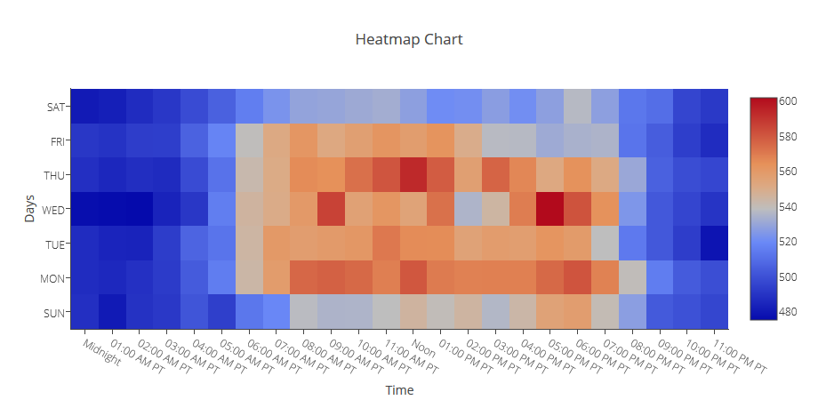

REQUIREMENTS
-------------------------
    PHP Version 5.6 or later
    Apache 2 or later
    Windows 7 or later /Linux 3 or later
    Firefox 52, Chrome 57, IE 8

INSTALLATION 
------------

INSTALLER
.........

1) Extract the product archive in web root. e.g. www.dashboarduilder
2) Open it in browser to run installer. e.g. http://localhost/ dashboarduilder

INTEGRATION
-----------
- For integration in your app, you need to copy the PHP code to your php application.

1) The folder "inc", “assets” and “css” will be replaced by path where you place 'lib' folder (if changed)

<pre>
 &lt;script src="assets/js/dashboard.min.js"&gt;&lt;/script&gt;&nbsp; &lt;! --&nbsp; copy this file to assets/js folder -- &gt;
 &lt;link rel="stylesheet" href="css/bootstrap.min.css"&gt; &lt;! --&nbsp; Bootstrap CSS file, change the path accordingly -- &gt;
</pre>

2) Update include path where you place “inc/dashboard_dist.php”. (if changed)

	Include(“inc/dashboard_dist.php");
Refer 'Getting Started' section on https://www.dashboardbuilder.net/documentation for more details.

Refer 'Support' on https://www.dashboardbuilder.net/support for queries and support.

RESULT
------

PHP CODE
--------
<pre>
/**
 * DashboardBuilder
 *
 * @author Diginix Technologies www.diginixtech.com
 * Support  - http://www.dashboardbuilder.net
 * @copyright (C) 2017 Dashboardbuilder.net
 * @version 1.0.1
 * @license: license.txt
 */

include(&quot;inc/dashboard_dist.php&quot;);  // copy this file to inc folder 

// for chart #1
$data = new dashboardbuilder(); 
$data-&gt;type =  &quot;heatmap&quot;;

$data-&gt;xaxis[0]= [&quot;Midnight&quot;,&quot;01:00 AM PT&quot;,&quot;02:00 AM PT&quot;,&quot;03:00 AM PT&quot;,&quot;04:00 AM PT&quot;,&quot;05:00 AM PT&quot;,&quot;06:00 AM PT&quot;,&quot;07:00 AM PT&quot;,&quot;08:00 AM PT&quot;,&quot;09:00 AM PT&quot;,&quot;10:00 AM PT&quot;,&quot;11:00 AM PT&quot;,&quot;Noon&quot;,&quot;01:00 PM PT&quot;,&quot;02:00 PM PT&quot;,&quot;03:00 PM PT&quot;,&quot;04:00 PM PT&quot;,&quot;05:00 PM PT&quot;,&quot;06:00 PM PT&quot;,&quot;07:00 PM PT&quot;,&quot;08:00 PM PT&quot;,&quot;09:00 PM PT&quot;,&quot;10:00 PM PT&quot;,&quot;11:00 PM PT&quot;]; 
$data-&gt;xaxis[1]= [&quot;Midnight&quot;,&quot;01:00 AM PT&quot;,&quot;02:00 AM PT&quot;,&quot;03:00 AM PT&quot;,&quot;04:00 AM PT&quot;,&quot;05:00 AM PT&quot;,&quot;06:00 AM PT&quot;,&quot;07:00 AM PT&quot;,&quot;08:00 AM PT&quot;,&quot;09:00 AM PT&quot;,&quot;10:00 AM PT&quot;,&quot;11:00 AM PT&quot;,&quot;Noon&quot;,&quot;01:00 PM PT&quot;,&quot;02:00 PM PT&quot;,&quot;03:00 PM PT&quot;,&quot;04:00 PM PT&quot;,&quot;05:00 PM PT&quot;,&quot;06:00 PM PT&quot;,&quot;07:00 PM PT&quot;,&quot;08:00 PM PT&quot;,&quot;09:00 PM PT&quot;,&quot;10:00 PM PT&quot;,&quot;11:00 PM PT&quot;];
$data-&gt;xaxis[2]= [&quot;Midnight&quot;,&quot;01:00 AM PT&quot;,&quot;02:00 AM PT&quot;,&quot;03:00 AM PT&quot;,&quot;04:00 AM PT&quot;,&quot;05:00 AM PT&quot;,&quot;06:00 AM PT&quot;,&quot;07:00 AM PT&quot;,&quot;08:00 AM PT&quot;,&quot;09:00 AM PT&quot;,&quot;10:00 AM PT&quot;,&quot;11:00 AM PT&quot;,&quot;Noon&quot;,&quot;01:00 PM PT&quot;,&quot;02:00 PM PT&quot;,&quot;03:00 PM PT&quot;,&quot;04:00 PM PT&quot;,&quot;05:00 PM PT&quot;,&quot;06:00 PM PT&quot;,&quot;07:00 PM PT&quot;,&quot;08:00 PM PT&quot;,&quot;09:00 PM PT&quot;,&quot;10:00 PM PT&quot;,&quot;11:00 PM PT&quot;];
$data-&gt;xaxis[3]= [&quot;Midnight&quot;,&quot;01:00 AM PT&quot;,&quot;02:00 AM PT&quot;,&quot;03:00 AM PT&quot;,&quot;04:00 AM PT&quot;,&quot;05:00 AM PT&quot;,&quot;06:00 AM PT&quot;,&quot;07:00 AM PT&quot;,&quot;08:00 AM PT&quot;,&quot;09:00 AM PT&quot;,&quot;10:00 AM PT&quot;,&quot;11:00 AM PT&quot;,&quot;Noon&quot;,&quot;01:00 PM PT&quot;,&quot;02:00 PM PT&quot;,&quot;03:00 PM PT&quot;,&quot;04:00 PM PT&quot;,&quot;05:00 PM PT&quot;,&quot;06:00 PM PT&quot;,&quot;07:00 PM PT&quot;,&quot;08:00 PM PT&quot;,&quot;09:00 PM PT&quot;,&quot;10:00 PM PT&quot;,&quot;11:00 PM PT&quot;];
$data-&gt;xaxis[4]= [&quot;Midnight&quot;,&quot;01:00 AM PT&quot;,&quot;02:00 AM PT&quot;,&quot;03:00 AM PT&quot;,&quot;04:00 AM PT&quot;,&quot;05:00 AM PT&quot;,&quot;06:00 AM PT&quot;,&quot;07:00 AM PT&quot;,&quot;08:00 AM PT&quot;,&quot;09:00 AM PT&quot;,&quot;10:00 AM PT&quot;,&quot;11:00 AM PT&quot;,&quot;Noon&quot;,&quot;01:00 PM PT&quot;,&quot;02:00 PM PT&quot;,&quot;03:00 PM PT&quot;,&quot;04:00 PM PT&quot;,&quot;05:00 PM PT&quot;,&quot;06:00 PM PT&quot;,&quot;07:00 PM PT&quot;,&quot;08:00 PM PT&quot;,&quot;09:00 PM PT&quot;,&quot;10:00 PM PT&quot;,&quot;11:00 PM PT&quot;];
$data-&gt;xaxis[5]= [&quot;Midnight&quot;,&quot;01:00 AM PT&quot;,&quot;02:00 AM PT&quot;,&quot;03:00 AM PT&quot;,&quot;04:00 AM PT&quot;,&quot;05:00 AM PT&quot;,&quot;06:00 AM PT&quot;,&quot;07:00 AM PT&quot;,&quot;08:00 AM PT&quot;,&quot;09:00 AM PT&quot;,&quot;10:00 AM PT&quot;,&quot;11:00 AM PT&quot;,&quot;Noon&quot;,&quot;01:00 PM PT&quot;,&quot;02:00 PM PT&quot;,&quot;03:00 PM PT&quot;,&quot;04:00 PM PT&quot;,&quot;05:00 PM PT&quot;,&quot;06:00 PM PT&quot;,&quot;07:00 PM PT&quot;,&quot;08:00 PM PT&quot;,&quot;09:00 PM PT&quot;,&quot;10:00 PM PT&quot;,&quot;11:00 PM PT&quot;];
$data-&gt;xaxis[6]= [&quot;Midnight&quot;,&quot;01:00 AM PT&quot;,&quot;02:00 AM PT&quot;,&quot;03:00 AM PT&quot;,&quot;04:00 AM PT&quot;,&quot;05:00 AM PT&quot;,&quot;06:00 AM PT&quot;,&quot;07:00 AM PT&quot;,&quot;08:00 AM PT&quot;,&quot;09:00 AM PT&quot;,&quot;10:00 AM PT&quot;,&quot;11:00 AM PT&quot;,&quot;Noon&quot;,&quot;01:00 PM PT&quot;,&quot;02:00 PM PT&quot;,&quot;03:00 PM PT&quot;,&quot;04:00 PM PT&quot;,&quot;05:00 PM PT&quot;,&quot;06:00 PM PT&quot;,&quot;07:00 PM PT&quot;,&quot;08:00 PM PT&quot;,&quot;09:00 PM PT&quot;,&quot;10:00 PM PT&quot;,&quot;11:00 PM PT&quot;];
$data-&gt;yaxis[0]= [&quot;SUN&quot;,&quot;MON&quot;,&quot;TUE&quot;,&quot;WED&quot;,&quot;THU&quot;,&quot;FRI&quot;,&quot;SAT&quot;,];
$data-&gt;yaxis[1]= [&quot;Midnight&quot;,&quot;01:00 AM PT&quot;,&quot;02:00 AM PT&quot;,&quot;03:00 AM PT&quot;,&quot;04:00 AM PT&quot;,&quot;05:00 AM PT&quot;,&quot;06:00 AM PT&quot;,&quot;07:00 AM PT&quot;,&quot;08:00 AM PT&quot;,&quot;09:00 AM PT&quot;,&quot;10:00 AM PT&quot;,&quot;11:00 AM PT&quot;,&quot;Noon&quot;,&quot;01:00 PM PT&quot;,&quot;02:00 PM PT&quot;,&quot;03:00 PM PT&quot;,&quot;04:00 PM PT&quot;,&quot;05:00 PM PT&quot;,&quot;06:00 PM PT&quot;,&quot;07:00 PM PT&quot;,&quot;08:00 PM PT&quot;,&quot;09:00 PM PT&quot;,&quot;10:00 PM PT&quot;,&quot;11:00 PM PT&quot;];
$data-&gt;yaxis[2]= [&quot;Midnight&quot;,&quot;01:00 AM PT&quot;,&quot;02:00 AM PT&quot;,&quot;03:00 AM PT&quot;,&quot;04:00 AM PT&quot;,&quot;05:00 AM PT&quot;,&quot;06:00 AM PT&quot;,&quot;07:00 AM PT&quot;,&quot;08:00 AM PT&quot;,&quot;09:00 AM PT&quot;,&quot;10:00 AM PT&quot;,&quot;11:00 AM PT&quot;,&quot;Noon&quot;,&quot;01:00 PM PT&quot;,&quot;02:00 PM PT&quot;,&quot;03:00 PM PT&quot;,&quot;04:00 PM PT&quot;,&quot;05:00 PM PT&quot;,&quot;06:00 PM PT&quot;,&quot;07:00 PM PT&quot;,&quot;08:00 PM PT&quot;,&quot;09:00 PM PT&quot;,&quot;10:00 PM PT&quot;,&quot;11:00 PM PT&quot;];
$data-&gt;yaxis[3]= [&quot;Midnight&quot;,&quot;01:00 AM PT&quot;,&quot;02:00 AM PT&quot;,&quot;03:00 AM PT&quot;,&quot;04:00 AM PT&quot;,&quot;05:00 AM PT&quot;,&quot;06:00 AM PT&quot;,&quot;07:00 AM PT&quot;,&quot;08:00 AM PT&quot;,&quot;09:00 AM PT&quot;,&quot;10:00 AM PT&quot;,&quot;11:00 AM PT&quot;,&quot;Noon&quot;,&quot;01:00 PM PT&quot;,&quot;02:00 PM PT&quot;,&quot;03:00 PM PT&quot;,&quot;04:00 PM PT&quot;,&quot;05:00 PM PT&quot;,&quot;06:00 PM PT&quot;,&quot;07:00 PM PT&quot;,&quot;08:00 PM PT&quot;,&quot;09:00 PM PT&quot;,&quot;10:00 PM PT&quot;,&quot;11:00 PM PT&quot;];
$data-&gt;yaxis[4]= [&quot;Midnight&quot;,&quot;01:00 AM PT&quot;,&quot;02:00 AM PT&quot;,&quot;03:00 AM PT&quot;,&quot;04:00 AM PT&quot;,&quot;05:00 AM PT&quot;,&quot;06:00 AM PT&quot;,&quot;07:00 AM PT&quot;,&quot;08:00 AM PT&quot;,&quot;09:00 AM PT&quot;,&quot;10:00 AM PT&quot;,&quot;11:00 AM PT&quot;,&quot;Noon&quot;,&quot;01:00 PM PT&quot;,&quot;02:00 PM PT&quot;,&quot;03:00 PM PT&quot;,&quot;04:00 PM PT&quot;,&quot;05:00 PM PT&quot;,&quot;06:00 PM PT&quot;,&quot;07:00 PM PT&quot;,&quot;08:00 PM PT&quot;,&quot;09:00 PM PT&quot;,&quot;10:00 PM PT&quot;,&quot;11:00 PM PT&quot;];
$data-&gt;yaxis[5]= [&quot;Midnight&quot;,&quot;01:00 AM PT&quot;,&quot;02:00 AM PT&quot;,&quot;03:00 AM PT&quot;,&quot;04:00 AM PT&quot;,&quot;05:00 AM PT&quot;,&quot;06:00 AM PT&quot;,&quot;07:00 AM PT&quot;,&quot;08:00 AM PT&quot;,&quot;09:00 AM PT&quot;,&quot;10:00 AM PT&quot;,&quot;11:00 AM PT&quot;,&quot;Noon&quot;,&quot;01:00 PM PT&quot;,&quot;02:00 PM PT&quot;,&quot;03:00 PM PT&quot;,&quot;04:00 PM PT&quot;,&quot;05:00 PM PT&quot;,&quot;06:00 PM PT&quot;,&quot;07:00 PM PT&quot;,&quot;08:00 PM PT&quot;,&quot;09:00 PM PT&quot;,&quot;10:00 PM PT&quot;,&quot;11:00 PM PT&quot;];
$data-&gt;yaxis[6]= [&quot;Midnight&quot;,&quot;01:00 AM PT&quot;,&quot;02:00 AM PT&quot;,&quot;03:00 AM PT&quot;,&quot;04:00 AM PT&quot;,&quot;05:00 AM PT&quot;,&quot;06:00 AM PT&quot;,&quot;07:00 AM PT&quot;,&quot;08:00 AM PT&quot;,&quot;09:00 AM PT&quot;,&quot;10:00 AM PT&quot;,&quot;11:00 AM PT&quot;,&quot;Noon&quot;,&quot;01:00 PM PT&quot;,&quot;02:00 PM PT&quot;,&quot;03:00 PM PT&quot;,&quot;04:00 PM PT&quot;,&quot;05:00 PM PT&quot;,&quot;06:00 PM PT&quot;,&quot;07:00 PM PT&quot;,&quot;08:00 PM PT&quot;,&quot;09:00 PM PT&quot;,&quot;10:00 PM PT&quot;,&quot;11:00 PM PT&quot;];
$data-&gt;text[0]= [&quot;487.6&quot;,&quot;480&quot;,&quot;488.4&quot;,&quot;490.6&quot;,&quot;500.6&quot;,&quot;493&quot;,&quot;512.4&quot;,&quot;518.2&quot;,&quot;536.8&quot;,&quot;534&quot;,&quot;534.2&quot;,&quot;537.8&quot;,&quot;544.6&quot;,&quot;539.2&quot;,&quot;544.2&quot;,&quot;535.2&quot;,&quot;542.8&quot;,&quot;554.4&quot;,&quot;556.8&quot;,&quot;540&quot;,&quot;526.2&quot;,&quot;502.4&quot;,&quot;499.2&quot;,&quot;495.4&quot;];
$data-&gt;text[1]= [&quot;486.6&quot;,&quot;485.2&quot;,&quot;488&quot;,&quot;491.8&quot;,&quot;502.8&quot;,&quot;514.6&quot;,&quot;543&quot;,&quot;557.6&quot;,&quot;575&quot;,&quot;576.6&quot;,&quot;574.4&quot;,&quot;568.2&quot;,&quot;579.4&quot;,&quot;569.4&quot;,&quot;567.6&quot;,&quot;567.8&quot;,&quot;567.8&quot;,&quot;574.4&quot;,&quot;580.2&quot;,&quot;567.4&quot;,&quot;538.8&quot;,&quot;514.6&quot;,&quot;502.8&quot;,&quot;498.2&quot;];
$data-&gt;text[2]= [&quot;486.4&quot;,&quot;483.8&quot;,&quot;483.2&quot;,&quot;492.2&quot;,&quot;506&quot;,&quot;511.6&quot;,&quot;543.6&quot;,&quot;559.2&quot;,&quot;556.8&quot;,&quot;558.4&quot;,&quot;559.8&quot;,&quot;570&quot;,&quot;564.6&quot;,&quot;564.2&quot;,&quot;554.4&quot;,&quot;557.4&quot;,&quot;556.6&quot;,&quot;561.2&quot;,&quot;558.2&quot;,&quot;537.8&quot;,&quot;513.4&quot;,&quot;501.8&quot;,&quot;492.4&quot;,&quot;478.2&quot;];
$data-&gt;text[3]= [&quot;476&quot;,&quot;475.2&quot;,&quot;474.6&quot;,&quot;483.4&quot;,&quot;490.2&quot;,&quot;515&quot;,&quot;544.6&quot;,&quot;549.6&quot;,&quot;558.8&quot;,&quot;585.2&quot;,&quot;555&quot;,&quot;560.8&quot;,&quot;554&quot;,&quot;572.2&quot;,&quot;534.2&quot;,&quot;543.8&quot;,&quot;568.6&quot;,&quot;601&quot;,&quot;580.6&quot;,&quot;562.4&quot;,&quot;523.4&quot;,&quot;501.6&quot;,&quot;495&quot;,&quot;489.2&quot;];
$data-&gt;text[4]= [&quot;487.6&quot;,&quot;484.6&quot;,&quot;487.2&quot;,&quot;486&quot;,&quot;497.4&quot;,&quot;511&quot;,&quot;541.4&quot;,&quot;550&quot;,&quot;564.4&quot;,&quot;563&quot;,&quot;572.4&quot;,&quot;579.8&quot;,&quot;592.4&quot;,&quot;578&quot;,&quot;556&quot;,&quot;575.8&quot;,&quot;565.8&quot;,&quot;551.4&quot;,&quot;562.4&quot;,&quot;550.8&quot;,&quot;529.6&quot;,&quot;504.8&quot;,&quot;497.8&quot;,&quot;495.6&quot;];
$data-&gt;text[5]= [&quot;490.2&quot;,&quot;488.8&quot;,&quot;492.4&quot;,&quot;492.6&quot;,&quot;505.2&quot;,&quot;517&quot;,&quot;538.4&quot;,&quot;550.8&quot;,&quot;560.4&quot;,&quot;551.4&quot;,&quot;555.8&quot;,&quot;561&quot;,&quot;557.2&quot;,&quot;561.8&quot;,&quot;549&quot;,&quot;536.4&quot;,&quot;536&quot;,&quot;530.6&quot;,&quot;533&quot;,&quot;534&quot;,&quot;511.6&quot;,&quot;503.6&quot;,&quot;492.6&quot;,&quot;486.6&quot;];
$data-&gt;text[6]= [&quot;480.2&quot;,&quot;481.8&quot;,&quot;486.4&quot;,&quot;490.4&quot;,&quot;497.4&quot;,&quot;504.8&quot;,&quot;515&quot;,&quot;522.4&quot;,&quot;528&quot;,&quot;528.8&quot;,&quot;530.4&quot;,&quot;531.6&quot;,&quot;526.8&quot;,&quot;520&quot;,&quot;520.8&quot;,&quot;526&quot;,&quot;520.6&quot;,&quot;526.8&quot;,&quot;536&quot;,&quot;526.8&quot;,&quot;512.4&quot;,&quot;509.4&quot;,&quot;495.2&quot;,&quot;490.8&quot;];

$data-&gt;name = &quot;col0&quot;;
$data-&gt;title = &quot;Heatmap Chart&quot;;
$data-&gt;orientation = &quot;&quot;;
$data-&gt;xaxistitle = &quot;Time&quot;;
$data-&gt;yaxistitle = &quot;Days&quot;;
$data-&gt;showgrid = &quot;&quot;;
$data-&gt;showline = &quot;&quot;;
$data-&gt;height = &quot;&quot;;
$data-&gt;width = &quot;&quot;;
$data-&gt;tracename[0]=  &quot;area&quot;;

$result[0] = $data-&gt;result();

?&gt;

&lt;!DOCTYPE html&gt;
&lt;html&gt; 
&lt;head&gt; 
	&lt;script src=&quot;assets/js/dashboard.min.js&quot;&gt;&lt;/script&gt; &lt;!-- copy this file to assets/js folder --&gt; 
	&lt;!--&lt;link rel=&quot;stylesheet&quot; href=&quot;assets/css/bootstrap.min.css&quot;&gt; Bootstrap CSS file, change the path accordingly --&gt; 

&lt;style&gt;
&lt;!-- adjust the height width as per your need --&gt;;
/*
#col0{
height:350px;
}
#col1{
height:350px;
}
*/
&lt;/style&gt;

&lt;/head&gt;
&lt;body&gt; 

&lt;div class=&quot;container&quot;&gt;
&lt;div class=&quot;col-lg-12&quot;&gt;
&lt;div class=&quot;panel panel-default&quot;&gt;
&lt;div class=&quot;panel-heading&quot;&gt;&lt;/div&gt;
    &lt;div class=&quot;panel-body&quot;&gt;
        &lt;?php echo $result[0];?&gt;
    &lt;/div&gt;
&lt;/div&gt;
&lt;/div&gt;
&lt;/div&gt;
&lt;/body&gt;
</pre>

LICENSE
-------
Must read and agree LICENSE.txt before use.
